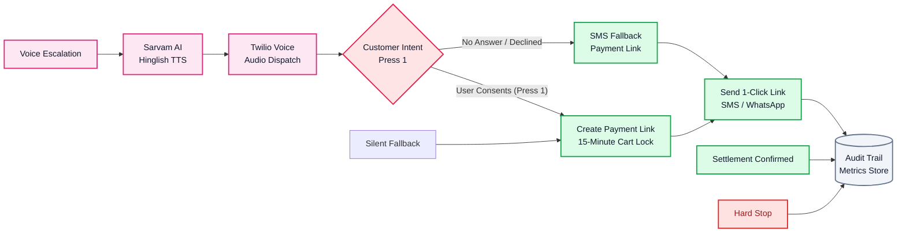

# FikrNot: Autonomous Indic Voice Recovery Agent for India
> **Track 03: Autonomous AI Revenue Recovery | Razorpay Buildathon**
> *"Payment Atka? Fikr Not!"* - Rescuing dropped checkouts and calming debit anxiety in under 10 seconds.

---

## Problem Statement: The $30B Flash Sale Checkout Drop in Indian Commerce
In India, UPI powers billions of checkouts monthly. During high-demand flash sales (such as Diwali or festive sales events), payment session timeouts and app-switch glitches cause critical revenue loss due to two primary psychological hurdles:
1. **Debit Anxiety**: When an order drops after entering a UPI PIN, buyers panic: *"Did my money deduct? Did my order confirm?"*
2. **Fear of Missing Out (FOMO)**: Buyers worry their limited-stock cart item will sell out before they can re-attempt payment.
3. **Delayed Outreach Failure**: Generic SMS notifications sent 30 to 45 minutes later fail to convert because buyers have already moved to competitors.
4. **Double Charges and Spam**: Naive automation leads to embarrassing outreach when payments actually captured in the background, or spams buyers who intentionally cancelled.

**FikrNot** is an autonomous, bounded AI voice recovery agent that detects dropped transactions in real-time, calms debit anxiety in natural Hinglish within 10 seconds, reserves the customer's cart for 15 minutes, and delivers an instant 1-click fallback session.

---

## Core Pillars: How FikrNot Rescues Flash Sale Revenue

### 1. Sub-10s Empathetic Hinglish Voice Call
When a high-value order drops, FikrNot dials the customer within 10 seconds while they are still holding their phone. Instead of a robotic alert, our agent speaks natural, reassuring Hinglish:
> *"Namaste Rahul ji, humne dekha aapka UPI session time out ho gaya. Fikr mat kijiye, agar paise kate hain toh bank auto-reverse ho jayenge. Aapka cart 15 minute ke liye reserve hai. Agar aap abhi pay karna chahte hain toh dialpad par 1 dabayein."*

### 2. 15-Minute Cart Reservation & Inventory Protection
During high-demand sales, cart drops trigger panic because limited-inventory products can sell out instantly. FikrNot locks the product inventory exclusively for the customer for 15 minutes, giving them guaranteed time to re-authorize payment without losing their deal.

### 3. Instant 1-Click SMS & WhatsApp Recovery
Customers who press '1' on their dialpad (or whose drop does not warrant an intrusive voice call) immediately receive a pre-filled 1-click recovery link via SMS and WhatsApp.

### 4. High-Conversion 1-Click Fallback Checkout
Opening the recovery link launches a frictionless fallback checkout with:
- A live 15:00 countdown timer showing inventory reservation status.
- Alternative high-success payment rails (Dynamic UPI QR and Direct UPI Push Collect) that completely eliminate app-switch timeout errors.

---

## System Architecture and Execution Flowcharts

### 1. Pre-Flight Verification and Decision Engine Pipeline
This phase ingests the Razorpay webhook, applies idempotency checks, verifies true settlement status via Razorpay APIs, and scores customer panic to select the optimal channel.

```mermaid
flowchart LR
    A([Customer at Checkout]) --> B[Payment Session Interrupted]
    B --> C[Razorpay Webhook<br>payment.failed]
    C --> D[Webhook Ingestion<br>Idempotency Buffer]
    D --> E{Pre-Flight Gate<br>Check Payment Status}
    
    E -- Captured / Authorized --> F[Settlement Confirmed<br>Send Order SMS]
    E -- Failed / Pending --> G{Rule Gate}
    
    G -- Customer Cancelled --> H[Hard Stop<br>Suppress Outreach]
    G -- Timeout / Gateway Error --> I[Diagnostic Engine<br>Panic Scoring]
    
    I -- "Low Panic (Ticket < ₹500)" --> J[Silent Fallback]
    I -- "High Panic (Ticket > ₹1,000)" --> K[Voice Escalation]

    style A fill:#e0f2fe,stroke:#0284c7,stroke-width:2px,color:#0f172a
    style B fill:#e0f2fe,stroke:#0284c7,stroke-width:2px,color:#0f172a
    style C fill:#fef3c7,stroke:#d97706,stroke-width:2px,color:#0f172a
    style D fill:#fef3c7,stroke:#d97706,stroke-width:2px,color:#0f172a
    style E fill:#ffe4e6,stroke:#e11d48,stroke-width:2px,color:#0f172a
    style F fill:#dcfce7,stroke:#16a34a,stroke-width:2px,color:#0f172a
    style G fill:#ffe4e6,stroke:#e11d48,stroke-width:2px,color:#0f172a
    style H fill:#fee2e2,stroke:#dc2626,stroke-width:2px,color:#991b1b
    style I fill:#f3e8ff,stroke:#9333ea,stroke-width:2px,color:#0f172a
    style J fill:#dcfce7,stroke:#16a34a,stroke-width:2px,color:#0f172a
    style K fill:#dcfce7,stroke:#16a34a,stroke-width:2px,color:#0f172a
```



---

### 2. Telephony Execution and 1-Click Fallback Pipeline
For high-panic failures, the autonomous voice agent initiates a conversational Hinglish call via Twilio + Sarvam AI. Keypress consent captures intent without asking for passwords, locking the customer's cart for 15 minutes.



---

## Key Highlights and Core Capabilities

| Feature | Description |
| :--- | :--- |
| **Sub-10s Indic Voice Call** | Places an empathetic Hinglish reassurance call while the buyer is still holding their phone. |
| **15-Min Flash Sale Cart Lock** | Holds high-demand inventory exclusively for the customer to prevent stockout anxiety. |
| **Zero-Spam Stopping Rules** | Deterministically suppresses calls when a buyer intentionally clicks cancel or money is already captured. |
| **Interactive DTMF Press 1** | Captures user recovery consent via keypad - 100% secure, zero PIN or password requests. |
| **1-Click Fallback Checkout** | Pre-fills order details and provides Dynamic UPI QR to eliminate app-switch timeout errors. |

---

## Technology Stack
- **AI Diagnosis and Scripting**: Google Gemini 2.5 Flash
- **Indic Speech Synthesis**: Sarvam AI (Bulbul / Indic TTS Models)
- **Telephony and IVR**: Twilio Voice API with DTMF Gather Webhooks
- **Frontend and Dashboard**: Next.js 14, Tailwind CSS, TypeScript, Lucide Icons
- **Backend Server**: Node.js, Express, TypeScript

## Engineering Principles and Safety Philosophy

### 1. High-Impact Problem Scope
- **The Problem**: Over $30B in Indian e-commerce checkout revenue is lost annually to UPI session timeouts and app-switch glitches.
- **The Human Pain Point**: When a payment drops after entering a UPI PIN, buyers experience intense debit anxiety (wondering if their money was lost or if their order confirmed) while limited flash-sale inventory goes out of stock.
- **Why It Matters**: Instead of building generic support bots, FikrNot attacks the single highest-intent drop-off point in Indian commerce.

### 2. Enterprise Build Quality and Reliability
- **Full-Stack Implementation**: Production-grade Next.js 14 frontend, TypeScript backend, and sub-500ms webhook ingestion.
- **Real Telephony and DTMF**: Live Twilio integration with DTMF keypress capture, active call state monitoring, and automated audio synthesis.
- **Reliable Cart Management**: 15-minute inventory reservation locks implemented with Redis TTL leases to prevent race conditions.

### 3. AI Philosophy: Where We Use AI (and Where We Do Not)
- **Where We Use AI**:
  - **Google Gemini 2.5 Flash**: Emotional panic scoring, intent classification, and dynamic Hinglish contextual reasoning.
  - **Sarvam AI**: Natural, low-latency Indic speech synthesis tailored for colloquial Indian commerce.
- **Where We Explicitly Choose NOT to Use AI**:
  - **Deterministic Safety Guardrails**: We do not use LLMs for financial settlement decisions or stopping rules.
  - **Pre-Flight Verification**: Strict API checks verify whether Razorpay already captured the payment to prevent double charges.
  - **Hard Stops**: Deterministic logic halts outreach if a buyer intentionally clicks cancel.

### 4. Resilient Session and Failure Recovery
- **What Breaks**: UPI app-switching between merchant apps and bank apps frequently times out or drops network packets.
- **How FikrNot Recovers**:
  1. **Sub-10s Reassurance**: Proactively dials the customer in Hinglish to explain that bank deductions auto-reverse in 48 hours.
  2. **15-Minute Inventory Lock**: Holds limited-stock cart items exclusively for the buyer to eliminate stockout fear.
  3. **Alternative Fallback Rails**: Provides Dynamic UPI QR and direct collect pushes on the recovery sheet, bypassing the broken app-switch loop.

---

## Getting Started Locally

### 1. Clone Repository and Install Dependencies
```bash
# Clone the repository
git clone https://github.com/charrviwadhwa/FikrNot.git
cd FikrNot

# Install Backend Dependencies
cd rebound-agent
npm install

# Install Frontend Dashboard Dependencies
cd ../dashboard
npm install
```

### 2. Configure Environment Variables
Create a `.env` file in `rebound-agent/`:
```env
PORT=3000
SERVER_BASE_URL=http://localhost:3000
GEMINI_API_KEY=your_gemini_api_key
SARVAM_API_KEY=your_sarvam_api_key
TWILIO_ACCOUNT_SID=your_twilio_sid
TWILIO_AUTH_TOKEN=your_twilio_auth_token
TWILIO_PHONE_NUMBER=your_twilio_number
DESTINATION_PHONE_NUMBER=+91XXXXXXXXXX
```

### 3. Run Applications
```bash
# Terminal 1: Run Backend Recovery Engine
cd rebound-agent
npm run dev

# Terminal 2: Run Next.js Landing and Operational Dashboard
cd dashboard
npm run dev
```

Open [http://localhost:3001](http://localhost:3001) for the Landing Page and [http://localhost:3001/demo](http://localhost:3001/demo) for the Operational Console.
