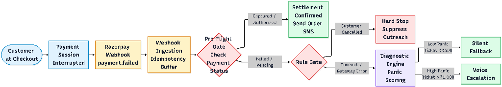
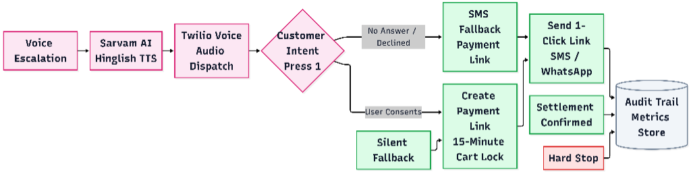
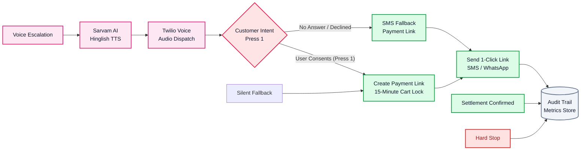

# 🛡️ FikrNot — Autonomous Indic Voice Recovery Agent for India
> **Track 03: Autonomous AI Revenue Recovery | Razorpay Buildathon**
> *"Payment Atka? Fikr Not!"* — Rescuing dropped checkouts and calming debit anxiety in under 10 seconds.

---

## 📌 Problem Statement: The $30B Panic Drop in Indian Commerce
In India, UPI powers billions of transactions monthly. However, **app-switch timeouts, transient bank outages, and connectivity drops** lead to massive checkout abandonment:
1. **Debit Anxiety**: When an order fails after UPI PIN entry, buyers panic: *"Did my money deduct? Did my order confirm?"*
2. **Delayed Outreach Failure**: Generic SMS notifications sent 30–45 minutes later fail to convert because buyers have already switched to competitors.
3. **Double Charges & Spam**: Naive automation leads to embarrassing outreach when payments actually captured in the background, or spams buyers who intentionally cancelled.

**FikrNot** solves this through an autonomous, bounded AI voice recovery agent that detects dropped transactions in real-time, calms debit anxiety in natural Hinglish within 10 seconds, and generates an instant 1-click fallback session.

---

## 🔄 End-to-End System Architecture & Flowcharts

### 1. Pre-Flight Verification & Decision Engine Pipeline
This phase ingests the Razorpay webhook, applies idempotency checks, verifies true settlement status via Razorpay APIs, and scores customer panic to select the optimal channel.




---

### 2. Telephony Execution & 1-Click Fallback Pipeline
For high-panic failures, the autonomous voice agent initiates a conversational Hinglish call via Twilio + Sarvam AI. Keypress consent captures intent without asking for passwords, locking the customer's cart for 15 minutes.





---

## ⚡ Key Highlights & Core Capabilities

| Feature | Description |
| :--- | :--- |
| **Sub-10s Indic Voice Call** | Places an empathetic Hinglish reassurance call while the buyer is still holding their phone. |
| **Zero-Spam Stopping Rules** | Deterministically suppresses calls when a buyer intentionally clicks cancel or money is already captured. |
| **Interactive DTMF 'Press 1'** | Captures user recovery consent via keypad — 100% secure, zero PIN/password requests. |
| **15-Min Inventory Lock** | Reserves high-demand cart items for 15 minutes to guarantee checkout completion. |
| **Alternative Fallback Rails** | Provides Dynamic UPI QR, Card, and NetBanking on the fallback sheet to eliminate app-switch drops. |

---

## 🛠️ Technology Stack
- **AI Diagnosis & Scripting**: Google Gemini 2.5 Flash
- **Indic Speech Synthesis**: Sarvam AI (Bulbul / Indic TTS Models)
- **Telephony & IVR**: Twilio Voice API with DTMF Gather Webhooks
- **Frontend & Dashboard**: Next.js 14, Tailwind CSS, TypeScript, Lucide Icons
- **Backend Server**: Node.js, Express, TypeScript

---

## 🚀 Getting Started Locally

### 1. Clone Repository & Install Dependencies
```bash
# Clone the repository
git clone https://github.com/charrviwadhwa/FikrNot.git
cd FikrNot

# Install Backend Dependencies
cd rebound-agent
npm install

# Install Frontend Dashboard Dependencies
cd ../dashboard
npm install
```

### 2. Configure Environment Variables
Create a `.env` file in `rebound-agent/`:
```env
PORT=3000
SERVER_BASE_URL=http://localhost:3000
GEMINI_API_KEY=your_gemini_api_key
SARVAM_API_KEY=your_sarvam_api_key
TWILIO_ACCOUNT_SID=your_twilio_sid
TWILIO_AUTH_TOKEN=your_twilio_auth_token
TWILIO_PHONE_NUMBER=your_twilio_number
DESTINATION_PHONE_NUMBER=+91XXXXXXXXXX
```

### 3. Run Applications
```bash
# Terminal 1: Run Backend Recovery Engine
cd rebound-agent
npm run dev

# Terminal 2: Run Next.js Landing & Operational Dashboard
cd dashboard
npm run dev
```

Open [http://localhost:3001](http://localhost:3001) for the Landing Page and [http://localhost:3001/demo](http://localhost:3001/demo) for the Operational Console.
